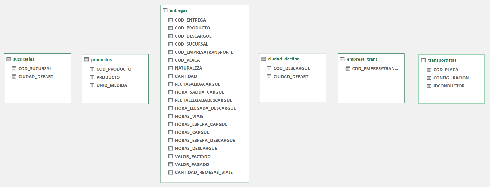
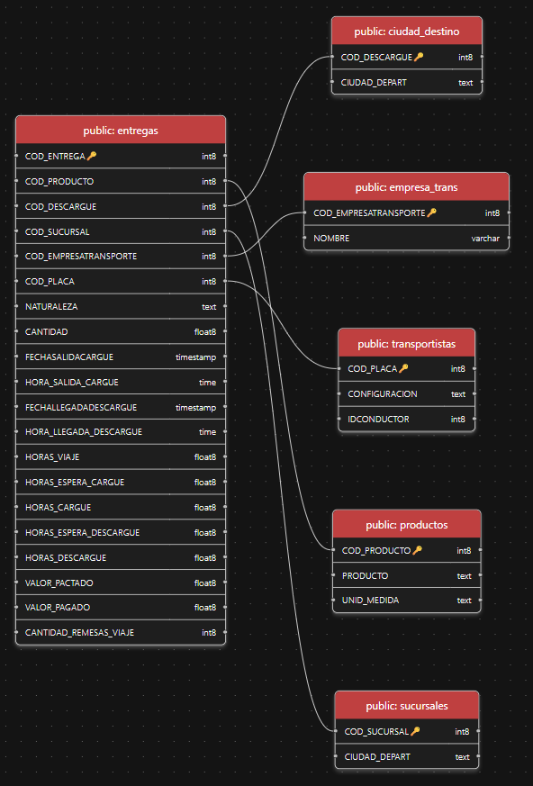
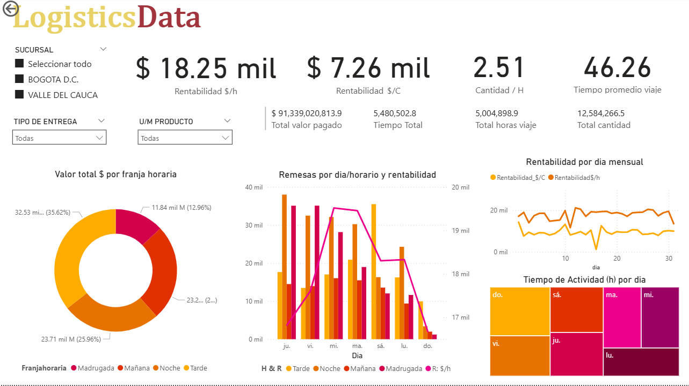

# Data-Logistics-Analytics

Proyecto orientado al análisis y procesamiento de datos, utilizando Excel, Python, PostgreSQL y Power BI. Este repositorio documenta el flujo completo desde la normalización del dataset original hasta su integración en una base de datos relacional para posteriores análisis e informes mediante la creacion de un dashboard.

Este proyecto simula los datos de una empresa logistica (sobre diversos datos de tiempos logísticos) que cuenta con sucursales en la nacion de colombia teniendo como socio a distribuidoras, los datos fueron sacados del portal de datos abiertos del gobierno colombiano: 

➡️ **Fuente de Datos:** [Tiempos Logísticos - datos.gov.co](https://www.datos.gov.co/Transporte/Tiempos-Log-sticos-de-cada-viaje-de-veh-culos-de-c/tfrd-amb4/about_data)

## 📌 Objetivos del Proyecto
* Transformar un *dataset* logístico plano en un conjunto de tablas **normalizadas**.
* Conectar y cargar estas tablas hacia **PostgreSQL** usando Python.
* Preparar la estructura para análisis estratégicos y *dashboards*.

## 🔧 Tecnologías Utilizadas
| Herramienta | Uso Principal |
| :--- | :--- |
| **Python** (pandas, SQLAlchemy) | ETL, Conexión y Carga de datos |
| **PostgreSQL** | Almacenamiento, Modelado Relacional y Consultas |
| **Excel / Power Query** | Limpieza y Normalización inicial |
| **SQL** | Definición del esquema y Análisis de negocio |

## 🚀 Desarrollo y Componentes del Pipeline

A continuación, se detalla el flujo completo aplicado en este proyecto, desde la normalización inicial hasta el modelado para Power BI.

### 1️⃣ Normalización de datos (Excel / Power Query)

Componente:
Limpieza, estandarización y separación lógica del dataset plano.

Desarrollo:
- Se depuraron columnas inconsistentes.
- Se separaron entidades como transportistas, empresas, viajes, ciudades, etc.
- Se detectaron llaves primarias y llaves foráneas.
- Se dejó la estructura lista para migrar a PostgreSQL.



---

### 2️⃣ Migración y conexión Python → PostgreSQL

Componente:
Carga automática de datos a la base de datos relacional.

Desarrollo:

- Se creó una base de datos nueva en PostgreSQL desde Python usando psycopg2.
- Se leyeron las hojas del archivo Excel normalizado.
- Se crearon tablas base e insertaron registros.

📌 Resultado: Base de datos poblada con las tablas normalizadas.

---

### 3️⃣ Modelado relacional en PostgreSQL (SQL)

Componente:
Creación del modelo estrella, claves, relaciones y reglas de integridad.

Desarrollo:

- Se generaron PRIMARY KEY para cada tabla.
- Se crearon FOREIGN KEY según las relaciones del modelo lógico.
- Se conectaron las tablas en un esquema tipo estrella.
- Se validaron las relaciones mediante el diagrama ER en la extensión de PostgreSQL para VS Code.



---

### 4️⃣ Columnas Calculadas y Análisis Estratégico (SQL)

Componente:
**Enriquecimiento del modelo para *Business Intelligence* (BI).**

Desarrollo:
- Se implementó una columna **`GENERATED ALWAYS AS`** para la **identificación legible** de la empresa de transporte.
- Se desarrollaron **consultas estratégicas** utilizando **CTEs** y **funciones de agregación** para medir:
    * **Rentabilidad por Hora** (Valor Pagado / Tiempo Total de Ciclo).
    * **Eficiencia Geográfica** y **Tiempos de Manejo** por destino.
    * **Consolidación de Carga** (análisis de la frecuencia de remesas).

📌 **Resultado:** Modelo robusto y enriquecido, listo para análisis escalables.

---

### 5️⃣ Integración con Power BI (Objetivo Final)



Tareas previstas:
- Conexión directa a PostgreSQL y validación del esquema.
- Creación de tablas de soporte (e.g., Tabla Calendario).
- Realizar transformaciones, limpiezas previas y columnas calculadas.
- Implementación de **medidas y KPIs** con DAX.
- Construcción del *dashboard* analítico de **tiempos logísticos**.

📌 Estado: Finalizado.

---

## 📁 Estructura del Repositorio
```
Data-Logistics-Analytics-Pipeline/
│
├── data/
│   └── Dataset limpio y dividido (Excel)
│
├── pythonFiles/
│   └── Scripts de conexión y carga (psycopg2)
│
├── sqlFiles/
│   └── Consultas SQL, creación de esquema y análisis
│
├── imagenes/
│   └── Imágenes de documentación
│
├── powerbi/
│   └── Archivo Power BI (.pbix)
│
└── README.md
    └── Documentación principal
```
---

